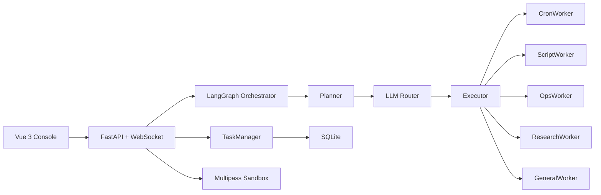

<div align="center">

# Local Cron Agent

### A local-first multi-agent control plane for automation, scheduling, and self-healing

<p>
  
  
  
  
  
  
</p>

<p>
  Turn natural language into managed cron jobs, sandbox scripts, health checks, and recovery workflows.
</p>


</div>

---

## Overview

Local Cron Agent is a compact operations console for local automation.  
It combines a Vue dashboard, FastAPI backend, LangGraph orchestration, and a sandbox tool layer to safely run and manage scheduled tasks.

Instead of one monolithic agent loop, responsibilities are split:

- **Orchestrator**: planning and step-level flow control.
- **Worker Agents**: execution by capability domain.
- **Tool Layer**: cron admin, shell execution, file writing, service control, health scan.
- **State Layer**: unified task state and run history in SQLite.

## What Makes It Useful

- Natural-language task management through chat.
- Multi-agent task routing and execution flow.
- Real-time stream feedback over WebSocket.
- Unified view of internal heartbeat jobs + sandbox cron jobs.
- Built-in health checks and auto-heal records.
- Local sandbox boundary (Multipass) for safer command execution.

## Architecture



## Core Screens

- **Dashboard**: status summary and quick task visibility.
- **Tasks**: pause/resume/delete/heal jobs.
- **Health**: system check and auto-heal feedback.
- **Heal Center**: categorized heal history.
- **Scripts**: sandbox file browser + editor.
- **Logs**: runtime logs.
- **AI Chat**: natural-language command surface.

## Tech Stack

```text
Frontend       Vue 3 + Vite
Backend        FastAPI + WebSocket + APScheduler
Orchestration  LangGraph
Agents         exquisite_agent + custom StreamingFCAgent
Persistence    SQLite
Memory         ChromaDB
Sandbox        Multipass Ubuntu VM
```

## Project Structure

```text
.
├── server.py                 # API entry + websocket stream + lifecycle jobs
├── langgraph_orchestrator.py # multi-agent flow + routing
├── streaming_fc_agent.py     # streaming function-calling worker
├── task_manager.py           # unified state + sync logic
├── models.py                 # SQLite models and queries
├── tools/                    # sandbox and control tools
├── frontend/                 # Vue application
├── agent_data/               # SQLite and vector db data
├── start.sh                  # robust start script
└── stop.sh                   # robust stop script
```

## Quick Start

### 1) Prepare sandbox

```bash
multipass launch 24.04 --name agent-sandbox --cpus 1 --memory 1G --disk 6G
```

### 2) Configure environment

Create `.env` (example):

```env
LLM_API_KEY=
LLM_MODEL_ID=qwen3.5-flash
LLM_BASE_URL=
SERPAPI_API_KEY=

DB_PERSIST_DIRECTORY=./agent_data/chroma_db
DB_COLLECTION_SOP=agent_sop_experience

EMBEDDING_PROVIDER=huggingface
EMBEDDING_MODEL=google/embeddinggemma-300m
```

### 3) Start

```bash
./start.sh
```

Open:

- Frontend: `http://localhost:5173`
- Backend: `http://localhost:8000`

Stop:

```bash
./stop.sh
```

## Important APIs

### Jobs

- `GET /api/jobs`
- `GET /api/jobs/internal`
- `GET /api/jobs/ubuntu`
- `POST /api/jobs/toggle`
- `POST /api/jobs/delete`

### Health / Healing

- `GET /api/tasks/health`
- `GET /api/tasks/{task_id}/runs`
- `POST /api/tasks/{task_id}/heal`
- `GET /api/heals/catalog`
- `GET /api/heals/history`
- `GET /api/system/health`
- `POST /api/system/health/check`

### Sandbox Files

- `GET /api/sandbox/ls`
- `GET /api/sandbox/read`
- `POST /api/sandbox/write`

### Streaming Chat

- `WS /ws/chat`

## Example Requests

- “List all jobs and pause the noisy one.”
- “Generate a cleanup script in sandbox and schedule it hourly.”
- “Run system health check and show what was auto-healed.”

## Notes

- Default sandbox name: `agent-sandbox`
- Keep local secrets and runtime artifacts out of version control.
