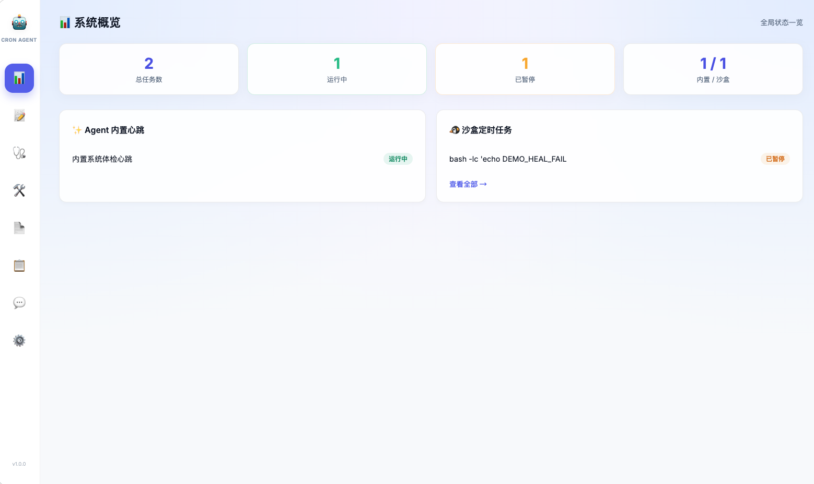
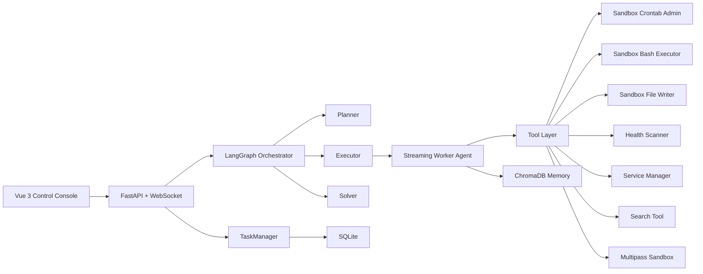

<div align="center">

# Local Cron Agent

### A multi-agent control plane for local automation, scheduling, and self-healing

<p>
  
  
  
  
  
  
</p>

<p>
  Turn natural-language instructions into scheduled jobs, sandbox actions, health checks, and recovery workflows through a layered multi-agent system.
</p>



</div>

---

## Overview

Local Cron Agent is a local-first automation platform built around a **multi-agent collaboration model**.

Instead of letting one monolithic agent do everything, the system splits responsibilities across:

- an **Orchestrator Agent** that plans and coordinates work,
- a **Worker Agent** that executes each step,
- and a **tool layer** specialized in cron management, shell execution, file generation, service control, system inspection, and recovery actions.

The result is a control surface where users can chat with the system, inspect scheduled jobs, repair failed tasks, browse sandbox files, and monitor health status from one interface.

## Why It Feels Different

Most cron dashboards stop at CRUD.  
Local Cron Agent goes further:

- it accepts natural-language requests instead of only form input,
- it executes through a multi-agent pipeline instead of a single opaque loop,
- it streams progress back to the UI so execution feels alive,
- and it closes the loop with health checks and self-healing history.

## Multi-Agent Design

This project is presented as a **real multi-agent collaborative system** with clear role separation.

| Layer | Role | Responsibility |
| --- | --- | --- |
| Orchestrator | Planner / Executor / Solver | Breaks down requests, manages state transitions, sequences work, and closes tasks |
| Worker Agent | Streaming execution agent | Handles step-level reasoning, tool calling, streaming progress, and result emission |
| Tool Agents | Domain capability layer | Cron admin, shell execution, file writing, health scanning, service control, search |
| State Layer | TaskManager + SQLite | Stores job state, sync status, run history, heal records |
| Memory Layer | ChromaDB + short-term context | Retains reusable SOP-like patterns and recent task context |

### How a complex request flows

1. A user sends a natural-language request from the Web UI.
2. The **LangGraph Orchestrator** converts that request into a stepwise execution plan.
3. The **Worker Agent** executes each step and calls the right tool.
4. Progress events stream back over WebSocket in real time.
5. Task status, health results, and recovery actions are persisted into the local data store.

## Architecture



## Product Surfaces

The frontend is not just a chat window. It is a compact operations console with multiple views:

- **Dashboard**: overall status for internal jobs and sandbox jobs
- **Tasks**: inspect, pause, resume, delete, and repair scheduled tasks
- **Health**: run system checks and review automated healing results
- **Heal Center**: browse healing actions, categories, and historical outcomes
- **Scripts**: browse and edit files inside the sandbox
- **Logs**: inspect backend runtime logs
- **AI Chat**: issue requests in natural language and watch execution stream live

## Core Capabilities

| Capability | Description |
| --- | --- |
| Natural-language task control | Manage jobs and automation through chat |
| Multi-agent orchestration | Use LangGraph to coordinate planner, executor, and solver roles |
| Streaming UX | Push step-level execution status through WebSocket |
| Unified task state | Merge internal jobs and sandbox cron jobs into one state model |
| Sandbox operations | Execute shell commands and scripts safely inside Multipass |
| Health and recovery | Run health probes, apply healing actions, and store recovery records |
| Memory-backed reuse | Preserve successful patterns through local vector memory |

## Tech Stack

```text
Frontend       Vue 3 + Vite
Backend        FastAPI + WebSocket + APScheduler
Agents         exquisite_agent + custom StreamingFCAgent
Orchestration  LangGraph
Persistence    SQLite
Memory         ChromaDB
Sandbox        Multipass Ubuntu VM
```

## Project Structure

```text
.
├── server.py                 # Backend entry, APIs, WebSocket streaming, health workflows
├── langgraph_orchestrator.py # Multi-agent orchestration layer
├── streaming_fc_agent.py     # Streaming worker agent
├── task_manager.py           # Unified task state manager
├── models.py                 # SQLite data model
├── tools/                    # Tool implementations
├── frontend/                 # Vue 3 application
├── agent_data/               # SQLite + vector memory storage
├── start.sh                  # Start backend + frontend
└── stop.sh                   # Stop backend + frontend
```

## Quick Start

### 1. Prepare the sandbox

```bash
multipass launch 24.04 --name agent-sandbox --cpus 1 --memory 1G --disk 6G
```

If the sandbox is broken, rebuild it:

```bash
multipass delete --purge agent-sandbox
multipass launch 24.04 --name agent-sandbox --cpus 1 --memory 1G --disk 6G
```

### 2. Configure environment

Create a `.env` with the required runtime values:

```env
LLM_API_KEY=
LLM_MODEL_ID=
LLM_BASE_URL=
SERPAPI_API_KEY=
DB_PERSIST_DIRECTORY=./agent_data/chroma_db
DB_COLLECTION_SOP=agent_sop_experience
EMBEDDING_PROVIDER=openai
EMBEDDING_MODEL=text-embedding-3-small
```

### 3. Run the app

Recommended:

```bash
./start.sh
```

Then open:

- Frontend: `http://localhost:5173`
- Backend: `http://localhost:8000`

Stop:

```bash
./stop.sh
```

## Manual Run

```bash
# backend
python -m uvicorn server:app --host 0.0.0.0 --port 8000

# frontend
cd frontend
npm install
npm run dev
```

## Important APIs

### Jobs

- `GET /api/jobs`
- `GET /api/jobs/internal`
- `GET /api/jobs/ubuntu`
- `POST /api/jobs/toggle`
- `POST /api/jobs/delete`

### Health and Healing

- `GET /api/tasks/health`
- `GET /api/tasks/{task_id}/runs`
- `POST /api/tasks/{task_id}/heal`
- `GET /api/heals/catalog`
- `GET /api/heals/history`
- `GET /api/system/health`
- `POST /api/system/health/check`

### Sandbox Files

- `GET /api/sandbox/ls`
- `GET /api/sandbox/read`
- `POST /api/sandbox/write`

### Streaming Chat

- `WS /ws/chat`

## Example Use Cases

- “List all current jobs and pause the noisy one.”
- “Write a cleanup script in the sandbox and schedule it to run every hour.”
- “Inspect system health, repair broken services, and report what changed.”
- “Show me healing history for failed tasks.”

## Notes

- This repository is designed to be viewed as a **multi-agent automation system**, not just a cron UI.
- The sandbox instance is named `agent-sandbox` by default throughout the project.
- Local state, logs, and secrets should stay out of version control.
